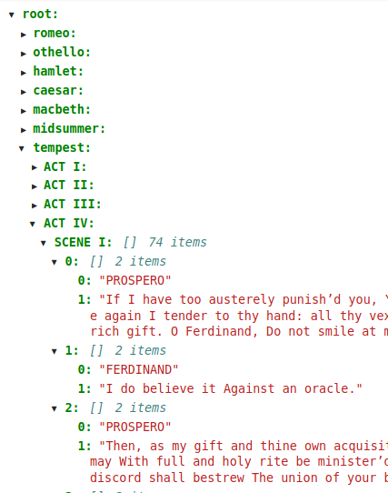
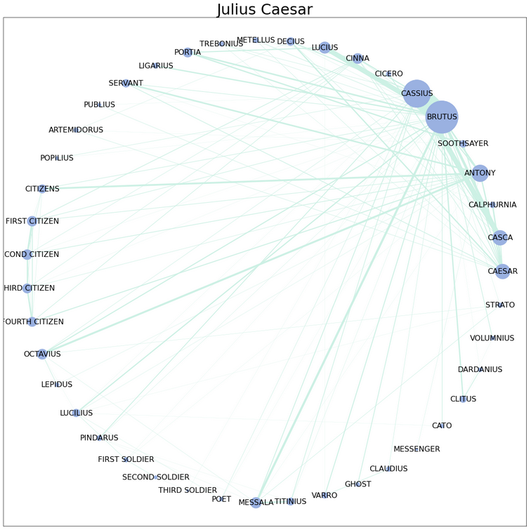
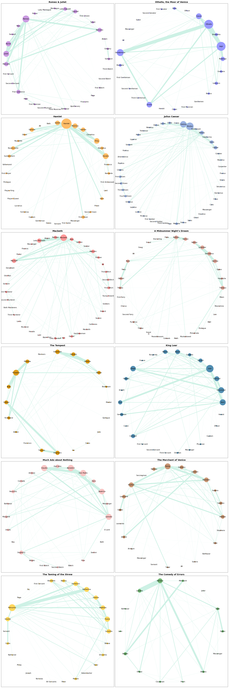

# Shakespearean Networks
## This project is an exploration of networks embedded in Shakespeare's plays through character dialogue.
### The consistent structure of the texts, including stage directions, helps faciliate the extraction of lines by scenes and acts. For instance, the acts and scenes generally begin with text such as 'Scene I. Venice. A street.' and each character's line starts with 'PUCK. How now, spirit! Whither wander you?'

### There are 12 plays included in this project:
- Romeo & Juliet
- Othello, the Moor of Venice
- Hamlet
- Julius Caesar
- Macbeth
- A Midsummer Night's Dream
- The Tempest
- King Lear
- Much Ado about Nothing
- The Merchant of Venice
- The Taming of the Shrew
- The Comedy of Errors

### I have generated JSON files of the individual plays as well as a comprehensive file containing all the plays (shakespeare_acts_scenes.json) in /output. You can traverse the keys and values to access character lines:

### The texts are all sourced from Project Gutenberg and have been saved to /data. I recommend using the files provided as a couple had to be edited so indicators like "SCENE #" were consistently capitalized. If you download the files from the provided urls (found in play_details.json) and process them with extract_acts_scenes.py you'll lose some scenes.

### The majority of the analysis is completed in NetworkX.

### Below is a visualization of the largest component based on character dialogue in Julius Caesar. The sizes of the nodes reflect how frequently a character speaks and the width of the edges reflect the frequency of turns between the two characters.

### [Click here to see visualizations of the largest component from all of the plays.]()

